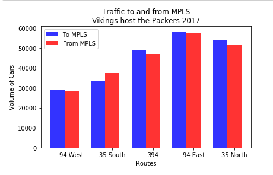

## About
   - This is one of the highlighted parts for our [first group project](https://github.com/Dkreitzer/Team_streprogen_Project1)(graded A+) of 
   the bootcamp [Data Visualization and Analytics](https://bootcamp.umn.edu/data/landing%20full/).
   - In this part, some interactive widgets are added into the jupyter notebook to visualize the event influence on traffic data collected 
   on sensors for severals highways of Minnesota. Based on that, we converted the jupyter notebook into an interactive webpage, using the package
   [nbinteract](https://www.nbinteract.com/).
   - A snapshot of the interactive part of the webpage:
     

